# Stockord: An Inventory Management System for Local Hardware Stores

Inventory is a highly significant asset for any business. Efficiently managing inventory is essential for the smooth functioning of businesses, particularly for hardware stores dealing with a wide variety of products. But even though we are in a time where there is a lot of modern technology, there are local hardware businesses that depend on manual inventory systems, causing them to face various issues and challenges.

Stockord is an inventory management system specifically designed for local hardware stores. The system aimed to modernize inventory management, procurement, and other business processes that were a challenge in these stores. It provided a platform for better organization, analysis, and processing of products, making it easier for employees to access information and manage stock.

## Features of Stockord

- Inventory Management: Track all inventory information within the store.
- Point of Sale (POS): Process transactions with customers, including generating digital receipts.  
- Procurement: Streamline transactions with suppliers, including request management.
- Product Filtering: Easily search and access specific items within the inventory.
- Barcode/QR Code Scanning: Quickly search and access products using barcodes or QR codes.
- Analytics Dashboard: Analyze sales data for better business decisions.
- User Roles: Assign different levels of access to different users (admin, employees, suppliers).
- Product Waste Tracking: Record instances of product waste.

## Utilized Technologies

- Development

  - IDE: Visual Studio Code
  - Programming Language: Python
  - Framework: Django (full-stack)
  - Front-end: HTML, CSS, JavaScript, Bootstrap
  - Database: PostgreSQL
  - Version Control: GitHub
  - UI Design: Figma
  - Project Management: Jira
- Other Technologies:

  - Barcode Scanning: ZXing library
  - Financial Forecasting: Plotly library
  - Cloud Infrastructure: Amazon Web Services (AWS)
  - EC2 (web server), RDS (database), S3 (storage), Cloudflare (domain/security)

## Access The System (Researchers Decided to Closed the Web Server to minimize the cost of billing)

- Website Link: https://www.stockord.win

Login As:

- TestSupplier or TestEmployee

  - Password: stockord
- Admin

  - password: admin

## About Us

We are 4th Year College Students taking Bachelor of Science in Information Systems from Technological University of the Philippines - Manila. This system is our IS Capstone Project.

## Authors

- [@SandorTheMoon](https://github.com/SandorTheMoon)
- [@ImYokaii](https://github.com/ImYokaii)
- [@TheMoreTheMary-er ](https://github.com/TheMoreTheMary-er)
- [@dadulsawol](https://github.com/dadulsawol)
- [@AlfredoDacquelJr](https://github.com/AlfredoDacquelJr)

## How to Run The Project Locally

### 1. Install Python

- Go to Python's official website and download the Python installer: [https://www.python.org/downloads/](https://www.python.org/downloads/)
- Run the installer **.exe** file.
- Be sure to tick the box of **Add python.exe to PATH.** before installation.
  - 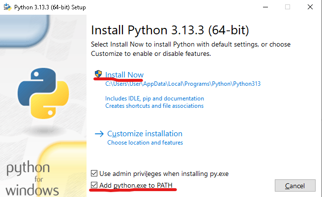
- Then proceed to the installation.

### 2. Cloning the repository

- Visit the Github repository: [https://github.com/SandorTheMoon/IMS-POS-Prod](https://github.com/SandorTheMoon/IMS-POS-Prod)
- Clone the repository in any of your preferred way.
  - 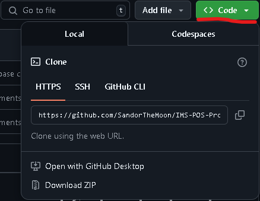

### 3. Setting Up Virtual Environment and Installing Requirements

- Open the project in an Integrated Development Environment (IDE) of your choice in this case, we used Visual Studio Code.
- Open the terminal.
  - To open terminal, press: **ctrl + `**
  - To open a new terminal, press: **ctrl + shift + `**
  - 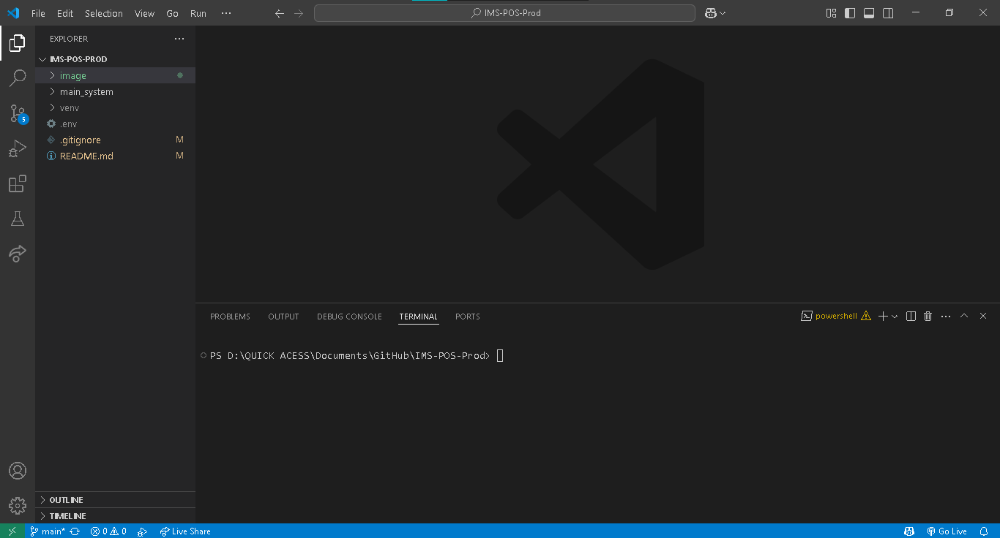
- In the terminal, run this command:
  - `python -m venv venv`
  - 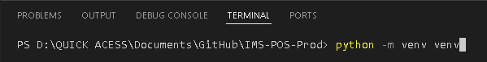
- This should create a folder named **venv** inside the project directory.
  - 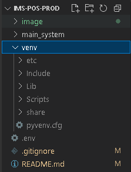
- Activate the Virtual Environment using this command:
  - `venv/Scripts/activate`
  - 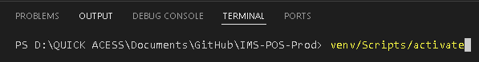
  - This is an indicator that you have successfully activated the Virtual Environment:
  - 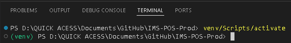
- Change the directory inside the main folder named **main_system** that contains all the system files by running this command:
  - `cd main_system`
  - 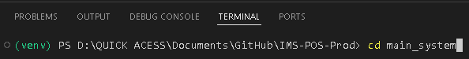
  - This is an indicator that you have successfully changed the directory to the main system folder.
  - 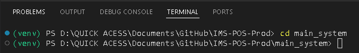
- Install the required package and dependency by running this command:
  - `pip install -r requirements.txt`
  - 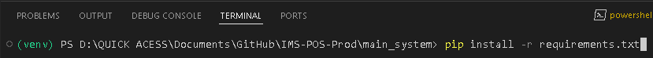
  - If the installation is successful, you'll see an output similar to this:
  - It may not look exactly the same in your case, but it should be something similar.
  - 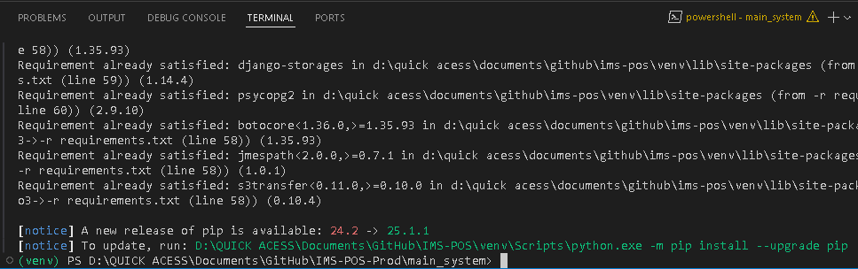

### 4. Setting Up Environment Variable (.env) File

- Inside the project's folder **IMS-POS-Prod**, create a new file and name it **.env**
  - 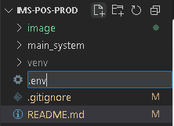
- Paste the following content inside the **.env** file and make sure to update the values according to your project's settings, as this will cause errors if not configured properly:
  ```env
  # Admin Dashboard's URL
  ADMIN_URL=your_admin_url

  # Database Configuration
  DATABASE_ENGINE=your_database_engine
  DATABASE_NAME=your_database_name
  DATABASE_USER=your_database_user
  DATABASE_PASSWORD=your_database_password
  DATABASE_HOST=your_database_host
  DATABASE_PORT=your_database_port

  # AWS S3 Credentials
  AWS_ACCESS_ID = your_aws_access_id
  AWS_SECRET_KEY = your_aws_secret_key
  AWS_BUCKET_NAME = your_aws_bucket_name

  # Django & App Security
  SECRET_KEY=your_django_secret_key
  RECAPTCHA_PUBLIC_KEY=your_recaptcha_public_key
  RECAPTCHA_PRIVATE_KEY=your_recaptcha_private_key

  # Login Security Configuration
  MAX_FAILED_LOGIN_ATTEMPTS=5
  FAILED_LOGIN_LOCK_DURATION=180

  # Quotation Number Range (used for generating quotation document numbers)
  MINIMUM_INT=1111111
  MAXIMUM_INT=9999999

  # TAX Value in decimal
  VALUE_ADDED_TAX=0.12

  # Logout URL
  LOGOUT_URL=/logout/

  # User Role 1's Accessible URLs
  ROLE_1_URL="/dashboard/dashboard/,/dashboard/dashboard,/dashboard/low_stock_products/,/dashboard/low_stock_products,/dashboard/financial_dashboard/,/dashboard/financial_dashboard,/inventory/product_list/,/inventory/product_list,/inventory/product_list/product_view/,/inventory/product_list/product_view,/inventory/restock_product_list/,/inventory/restock_product_list,/inventory/restock_product_list/restock_product_quantity/,/inventory/restock_product_list/restock_product_quantity,/inventory/to_waste_product_list/,/inventory/to_waste_product_list,/inventory/to_waste_product_list/transfer_to_waste/,/inventory/to_waste_product_list/transfer_to_waste,/inventory/edit_product_list/,/inventory/edit_product_list,/inventory/edit_product_list/edit_product/,/inventory/edit_product_list/edit_product,/inventory/add_new_product/,/inventory/add_new_product,/inventory/wasted_product_list/,/inventory/wasted_product_list,/inventory/invalid_request/,/inventory/invalid_request,/pos/pos_page/,/pos/pos_page,/pos/add_item/,/pos/add_item,/pos/edit_item/,/pos/edit_item,/pos/delete_item/,/pos/delete_item,/pos/complete_invoice/,/pos/complete_invoice,/pos/input_cash/,/pos/input_cash,/pos/transaction_summary/,/pos/transaction_summary,/pos/finish_transaction/,/pos/finish_transaction,/pos/receipt_page/,/pos/receipt_page,/pos/transaction_invoices/,/pos/transaction_invoices,/pos/transaction_invoices_detail/,/pos/transaction_invoices_detail,/pos/download_sales_invoice_pdf/,/pos/download_sales_invoice_pdf,/pos/invalid_request/,/pos/invalid_request,/procurement/invalid_request/,/procurement/invalid_request,/procurement/create_request_quotation/,/procurement/create_request_quotation,/procurement/accepted_quotations_list/,/procurement/accepted_quotations_list,/procurement/create_purchase_request_from_quotation/,/procurement/create_purchase_request_from_quotation,/procurement/request_quotation_list/,/procurement/request_quotation_list,/procurement/request_quotation_detail/,/procurement/request_quotation_detail,/procurement/download_request_quotation_pdf/,/procurement/download_request_quotation_pdf,/procurement/edit_unit_price_rq/,/procurement/edit_unit_price_rq,/procurement/view_supplier_quotations/,/procurement/g_quotations,/procurement/supplier_quotation_submission_detail/,/procurement/supplier_quotation_submission_detail,/procurement/download_supplier_quotation_pdf/,/procurement/download_supplier_quotation_pdf,/procurement/purchase_request_list/,/procurement/purchase_request_list,/procurement/purchase_request_detail/,/procurement/purchase_request_detail,/procurement/download_purchase_order_pdf/,/procurement/download_purchase_order_pdf,/procurement/purchase_invoice_list/,/procurement/purchase_invoice_list,/procurement/purchase_invoice_detail/,/procurement/purchase_invoice_detail,/procurement/download_purchase_invoice_pdf/,/procurement/download_purchase_invoice_pdf,/procurement/invalid_request/,/procurement/invalid_request,/profile/edit_profile/,/profile/edit_profile,/profile/change_password/,/profile/change_password,/logout/,/logout"
  
  # User Role 2's Accessible URLs
  ROLE_2_URL="/dashboard/dashboard/,/dashboard/dashboard,/dashboard/low_stock_products/,/dashboard/low_stock_products,/dashboard/financial_dashboard/,/dashboard/financial_dashboard,/inventory/product_list/,/inventory/product_list,/inventory/product_list/product_view/,/inventory/product_list/product_view,/inventory/wasted_product_list/,/inventory/wasted_product_list,/inventory/invalid_request/,/inventory/invalid_request,/pos/pos_page/,/pos/pos_page,/pos/add_item/,/pos/add_item,/pos/edit_item/,/pos/edit_item,/pos/delete_item/,/pos/delete_item,/pos/complete_invoice/,/pos/complete_invoice,/pos/input_cash/,/pos/input_cash,/pos/transaction_summary/,/pos/transaction_summary,/pos/finish_transaction/,/pos/finish_transaction,/pos/receipt_page/,/pos/receipt_page,/pos/invalid_request/,/pos/invalid_request,/profile/edit_profile/,/profile/edit_profile,/profile/change_password/,/profile/change_password,/logout/,/logout"
  
  # User Role 3's Accessible URLs
  ROLE_3_URL="/supplier/request_quotations_list/,/supplier/request_quotations_list,/supplier/request_quotations_detail/,/supplier/request_quotations_detail,/supplier/create_quotation_submission/,/supplier/create_quotation_submission,/supplier/quotation_submission_list/,/supplier/quotation_submission_list,/supplier/quotation_submission_detail/,/supplier/quotation_submission_detail,/supplier/download_quotation_submission_pdf/,/supplier/download_quotation_submission_pdf,/supplier/edit_unit_price_qs/,/supplier/edit_unit_price_qs,/supplier/purchase_orders_list/,/supplier/purchase_orders_list,/supplier/purchase_orders_detail/,/supplier/purchase_orders_detail,/supplier/download_purchase_orders_pdf/,/supplier/download_purchase_orders_pdf,/supplier/purchase_invoices_list/,/supplier/purchase_invoices_list,/supplier/purchase_invoices_detail/,/supplier/purchase_invoices_detail,/supplier/download_purchase_invoices_pdf/,/supplier/download_purchase_invoices_pdf,/supplier/invalid_request/,/supplier/invalid_request,/profile/edit_profile/,/profile/edit_profile,/profile/change_password/,/profile/change_password,/logout/,/logout"
  
  # User Role 4's Accessible URLs
  ROLE_4_URL="/wait_for_permission/,/wait_for_permission,/logout/,/logout"
  
  # User Roles
  ROLE_1=manager
  ROLE_2=employee
  ROLE_3=supplier
  ROLE_4=unkown

  # Product Category IDs
  CONCRETING_AND_MASONRY=01
  REBARS_AND_GI_WIRES=02
  ROOFING_AND_INSULATION=03
  STEEL=04
  WATER_PROOFING=05
  SEALANT_AND_ADHESIVE=06
  WOOD_PRODUCTS=07
  DRY_WALL_AND_CEILING=08
  PLUMBING_PIPES=09
  ELECTRICAL_PIPES=10
  WIRES_AND_CABLES=11
  TILING_SUPPLIES=12
  PAINTING_SUPPLIES=13
  DOOR_AND_CABINET_HARDWARES=14
  ELECTRICAL_FIXTURES_AND_DEVICES=15
  FINISHING_MATERIALS=16
  POWER_TOOLS_AND_EQUIPMENTS=17
  NAILS_AND_SCREWS=18
  SCREEN_AND_COVERS=19
  CHEMICALS=20
  UNKNOWN_CATEGORY=00

  # Product Categories List
  PRODUCT_CATEGORIES="All Categories,Concreting and Masonry,Rebars and Gi Wires,Roofing and Insulation,Steel,Water Proofing,Sealant and Adhesive,Wood Products,Dry Wall and Ceiling,Plumbing Pipes,Electrical Pipes,Wires and Cables,Tiling Supplies,Painting Supplies,Door and Cabinet Hardwares,Electrical Fixtures and Devices,Finishing Materials,Power Tools and Equipments,Nails and Screws,Screen and Covers,Chemicals"
  
  # Product Types List
  PRODUCT_TYPES="Perishable,Non-Perishable"

  # Product Statuses List
  PRODUCT_STATUS="Active,Inactive"

  # Document Statuses List
  RQ_STATUS_CHOICES="Ongoing,Ended"
  QS_STATUS_CHOICES="Pending,Accepted,Rejected"
  PO_STATUS_CHOICES="Pending,Approved,Rejected,Delivered,Received,Cancelled"
  PI_STATUS_CHOICES="Pending,Paid,Voided"
  SI_STATUS_CHOICES="Pending,Completed,Paid,Refunded,Voided"
  ````

### 5. Applying Migrations to the Database
- In order for database models to replicate and apply to the actual database instance, run the following command:
  - `py manage.py makemigrations`
  - 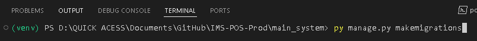
  - Then run this command: `py manage.py migrate`
  - 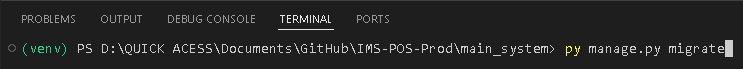
  - It may not look exactly the same in your case, but it should be something similar.
  - 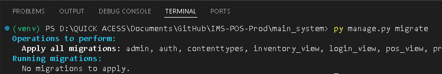
  


### 6. Running the Project Locally
- Open the Terminal **ctrl + `**
- or Open a New Terminal **ctrl + shift + `**
- Activate the Virtual Environment inside the project directory **IMS-POS-Prod** by running the command:
  - `venv/Scripts/activate`
  - 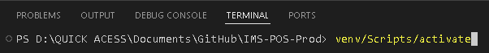
  - It should look like this, or something similar:
  - 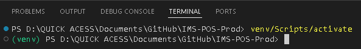
- Change the directory to the system's folder containing all system files by running the command:
  - `cd main_system`
  - 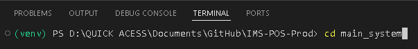
  - It should look like this, or something similar:
  - 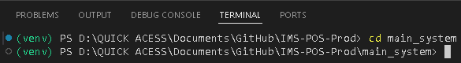
- To finally run the project, run the command:
  - `python manage.py runserver`
  - 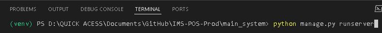
  - It should look like this:
  - 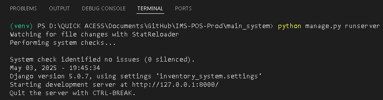
  - Then paste this URL in your preferred browser **http://127.0.0.1:8000/**
  - 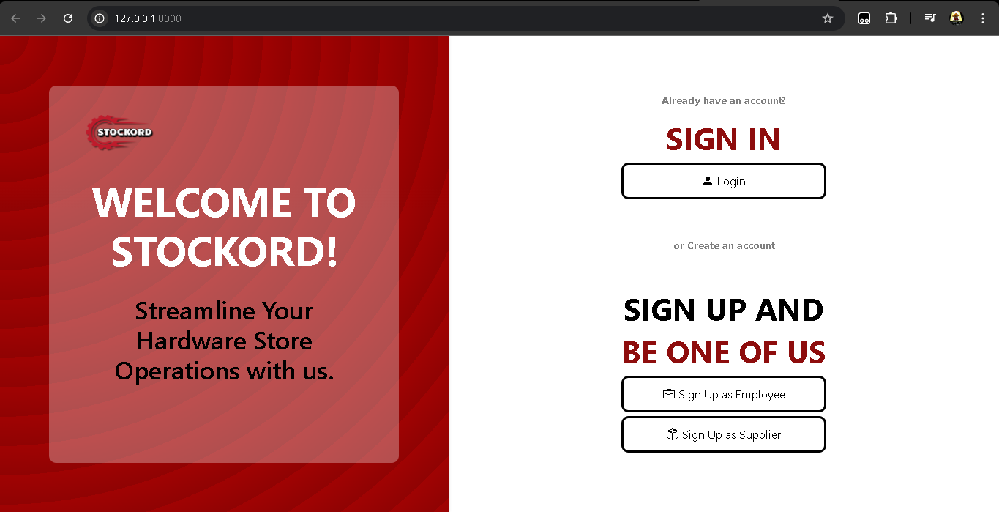